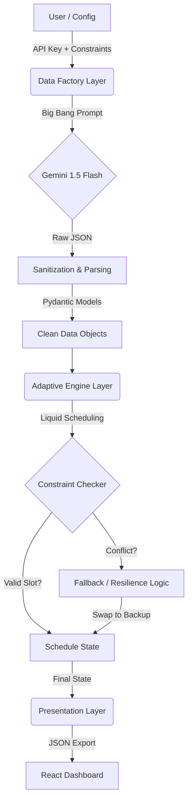

# 🏛️ System Architecture

The **Adaptive Health Allocator** is built on a modular **3-Stage Pipeline**: Generation, Scheduling, and Presentation. This architecture decouples the "World Creation" (GenAI) from the "World Solving" (Algorithms), ensuring that the scheduler is deterministic and testable even though the input data is dynamic.

---

## 🏗️ High-Level Diagram

## 1. Data Models (Schema & Enums)

The system relies on strict typing via **Pydantic Models** (`models.py`) to ensure data integrity across the pipeline.

### Core Entities

| Model | Purpose | Key Fields | Allowed Values (Enums) |
| --- | --- | --- | --- |
| **Activity** | Represents a single task | `id`, `type`, `priority`, `frequency` | **Types:** Fitness, Food, Medication, Therapy, Consultation.  **Frequency:** Daily, Weekly, Monthly. |
| **Specialist** | A human resource | `id`, `type`, `availability` | **Types:** Trainer, Therapist, Doctor, Nutritionist. |
| **TravelPeriod** | A context modifier | `location_type`, `remote_only` | **Locations:** Home, Hotel, Remote (Cabin/Camping). |
| **Equipment** | A physical resource | `id`, `is_portable` | **Portable:** True (Mat, Bands) or False (Treadmill). |

### Validation Rules

* **Priority:** Integer `1` (Critical) to `5` (Optional).
* **Duration:** Minimum `10` minutes.
* **Backup Link:** `backup_activity_ids` must reference a valid Activity ID in the same generation batch.

---

## 2. State Management (The "Memory")

**Role:** The "Ledger" that tracks truth.

The **`ScheduleState`** class is the single source of truth during the scheduling run. It is mutable and evolves as the engine iterates through days. It captures not just *what happened*, but *why* things failed.

### State Components Table

| Component | Type | Description | Why it matters |
| --- | --- | --- | --- |
| **`schedule`** | `Dict[Date, List[Slot]]` | The master timeline. Maps every date to a list of booked slots. | This is the final output that the UI renders. |
| **`daily_load`** | `Dict[Date, LoadMap]` | A heatmap tracking how many tasks of each priority are booked per day. | Used by the **Liquid Logic** to prevent burnout (e.g., "Max 2 High-Intensity tasks/day"). |
| **`weekly_counter`** | `Dict[ActivityID, Int]` | Tracks progress toward weekly quotas (e.g., "2/3 Gym Sessions"). | Allows tasks to "flow" to other days. If the counter isn't full, the task remains pending. |
| **`failed_activities`** | `List[FailureLog]` | A forensic log of every rejected task. | **Critical for Trust.** Stores the exact reason (e.g., "Blocked by Travel") so the UI can explain it to the user. |
| **`booked_slots`** | `List[TimeSlot]` | A flat list of all confirmed bookings. | Used for O(1) collision detection (Overlap checks). |

---

## 3. The Adaptive Engine Layer (Scheduler)

**Role:** The "Brain" that solves the time-allocation problem.

### Core Logic: Liquid Scheduling

Traditional schedulers are rigid ("Gym is on Monday"). Our engine uses **Liquid Weekly Quotas**:

1. **The Bucket:** Each activity has a quota (e.g., "3 times/week").
2. **The Flow:** The scheduler iterates through days. If Monday is full (or blocked by travel), the task "flows" naturally to Tuesday.
3. **Completion:** The engine is satisfied as soon as the *Quota* is met, regardless of the specific day.

### The Fallback Chain (Resilience Module)

When a high-priority task is blocked, the engine triggers a **Resilience Loop**:

1. **Primary Attempt:** Try to schedule "Heavy Lifting (Gym)".
2. **Failure Detection:** Blocked by "Travel (Remote Cabin)".
3. **Immediate Swap:** The engine retrieves the linked **Backup Activity** ("Bodyweight Flow").
4. **Diplomatic Immunity:** The backup is scheduled *immediately* on the same day, counting towards the Primary's weekly quota.

---

## 4. Constraint Validation (Guardrails)

**Role:** The "Law" that enforces physical reality.

Located in `scheduler/constraints.py`, this module answers a binary question: *"Can Activity X happen at Time Y?"*

### The "Diplomatic Immunity" Pattern

A critical architectural decision was how to handle **Travel Constraints**.

* **Standard Rule:** If User is at a `Hotel` or `Remote Cabin`, block all `Location: Home` activities.
* **The Problem:** This blocked Backup activities (like "Home Yoga") which are technically portable.
* **The Solution:** The Constraint Checker grants **Diplomatic Immunity** to any activity flagged as `is_backup=True`. It bypasses the location check, assuming backups are low-friction and portable by design.

---

## 5. The Data Factory Layer (Generators)

**Role:** The "Creator" that builds the simulation world.

### Key Components

* **`generators/data_factory.py`**: The main entry point.
* **"Big Bang" Strategy:** Instead of making 50 small API calls (which hits rate limits), we issue **one massive prompt** requesting all 50 activity pairs at once. This reduces latency by ~80%.
* **Sanitization Loop:** A custom logic layer that sits *between* the LLM response and Pydantic validation. It auto-corrects common errors:
* *Frequency Fix:* Converts hallucinated "Custom" patterns to "Weekly".
* *Duration Fix:* Bumps impossible "2-minute" workouts to a minimum of 10 minutes.