# 🏛️ System Architecture

The **Adaptive Health Allocator** is built on a modular **3-Stage Pipeline**: Generation, Scheduling, and Presentation. This architecture decouples the "World Creation" (GenAI) from the "World Solving" (Algorithms), ensuring that the scheduler is deterministic and testable even though the input data is dynamic.

---

## 🏗️ High-Level Diagram

## 1. Data Models (Schema & Enums)

The system relies on strict typing via **Pydantic Models** (`models.py`) to ensure data integrity across the pipeline.

### Core Entities

| Model | Purpose | Key Fields | Allowed Values (Enums) |
| --- | --- | --- | --- |
| **Activity** | Represents a single task | `id`, `type`, `priority`, `frequency` | **Types:** Fitness, Food, Medication, Therapy, Consultation.  **Frequency:** Daily, Weekly, Monthly. |
| **Specialist** | A human resource | `id`, `type`, `availability` | **Types:** Trainer, Therapist, Doctor, Nutritionist. |
| **TravelPeriod** | A context modifier | `location_type`, `remote_only` | **Locations:** Home, Hotel, Remote (Cabin/Camping). |
| **Equipment** | A physical resource | `id`, `is_portable` | **Portable:** True (Mat, Bands) or False (Treadmill). |

### Validation Rules

* **Priority:** Integer `1` (Critical) to `5` (Optional).
* **Duration:** Minimum `10` minutes.
* **Backup Link:** `backup_activity_ids` must reference a valid Activity ID in the same generation batch.

---

Here is the updated and comprehensive documentation for the **State Management** module, reflecting the new capabilities of the `SchedulerState` class.

---

## 2. State Management (The "Memory")

**Role:** The "Ledger" that tracks truth.

The **`SchedulerState`** class acts as the Central Nervous System of the scheduler. It is the single source of truth that evolves as the engine runs. It has been significantly upgraded from a simple "list of bookings" to an **Analytical Engine** that tracks not just *what* happened, but *how* (Resilience) and *why* (Diagnostics).

### 1. The Data Model (Storage)

The state uses optimized indices to ensure the scheduler remains fast ( lookups) even as the calendar fills up.

| Component | Type | Description | Strategic Value |
| --- | --- | --- | --- |
| **`booked_slots`** | `List[TimeSlot]` | The master ledger of every confirmed appointment. | The raw data for the final schedule. |
| **`specialist_bookings`** | `Dict[ID, List[Slot]]` | A lookup index for doctors/therapists. | **Speed.** Allows the `ConstraintChecker` to instantly know if "Dr. Smith" is busy without scanning the whole calendar. |
| **`equipment_bookings`** | `Dict[ID, List[Slot]]` | A lookup index for machines (Gym, Dialysis). | **Concurrency.** Tracks usage to enforce limits (e.g., "Only 1 user per Treadmill"). |
| **`activity_occurrences`** | `Dict[ID, Int]` | Tracks how many times an activity has been booked. | **Quota Tracking.** Ensures we hit the target (e.g., "3/3 Gym Sessions"). |
| **`backup_activations`** | `Dict[ID, List[Slot]]` | Maps Primary Activity IDs to their Backup replacements. | **Resilience Metrics.** Allows the system to report: *"You used your fallback plan 15% of the time."* |
| **`failed_activities`** | `Dict[ID, Attempt]` | A forensic log of aggregated failure reasons. | **Diagnostics.** Stores exactly why a task failed (e.g., "50 attempts blocked by Travel"). |

### 2. Functional API (Methods)

The class provides a strict interface for modifying and querying the state.

#### **State Mutation (Writing)**

| Method | Role | Logic & Side Effects |
| --- | --- | --- |
| **`add_booking(slot)`** | **The "Commit"** | • Adds slot to `booked_slots`. 

 • Immediately updates `specialist` and `equipment` indices. 

 • Increments `activity_occurrences`. 

 • If `slot.is_backup`, logs it in `backup_activations` for resilience tracking. |
| **`record_failure(act, viol)`** | **The "Error Log"** | • Does **not** store every single failed check (too noisy). 

 • Aggregates failures into `SchedulingAttempt` objects. 

 • Stores the specific `ConstraintViolation` so we can later distinguish between "Gym Full" vs. "User Traveling". |
| **`clear()`** | **The "Reset"** | • Wipes all lists and counters. 

 • Useful for testing or if the scheduler needs to restart a phase. |

#### **State Querying (Reading)**

| Method | Role | Logic |
| --- | --- | --- |
| **`get_slots_for_date(date)`** | **Daily View** | Returns all slots for a specific day. Used by the Scorer to calculate "Clustering" (batching tasks). |
| **`get_occurrence_count(id)`** | **Progress Check** | Simple integer lookup to check if an activity has met its frequency goal. |
| **`get_statistics()`** | **The "Dashboard"** | **Complex Analytics.** Generates the final report: 

 • **Resilience Rate:** `(Backup / Total) * 100`. 

 • **Priority Breakdown:** Success rates per priority tier (P1 vs P5). 

 • **Utilization:** Counts of resource usage. |
| **`get_failure_report()`** | **The "Post-Mortem"** | **Smart Filtering.** 

 • Filters out "noise" failures (e.g., initial failures that were later fixed by a backup). 

 • Returns only **Terminal Failures** (Exhaustion) to explain "Missed Opportunities" to the user. |

### 3. Visualizing State Flow

1. **Solver** finds a valid candidate.
2. **Commit:** Calls `add_booking`. Indices update instantly.
3. **Conflict Check (Next Task):** The next task queries `specialist_bookings` and sees the new block immediately.
4. **Reporting:** At the end of the run, `get_statistics` pulls from `backup_activations` to calculate how "resilient" the user's plan is.
---

## 3. The Adaptive Engine Layer (Scheduler)

**Role:** The "Brain" that solves the time-allocation problem.

### Core Logic: Liquid Scheduling

Traditional schedulers are rigid ("Gym is on Monday"). Our engine uses **Liquid Weekly Quotas**:

1. **The Bucket:** Each activity has a quota (e.g., "3 times/week").
2. **The Flow:** The scheduler iterates through days. If Monday is full (or blocked by travel), the task "flows" naturally to Tuesday.
3. **Completion:** The engine is satisfied as soon as the *Quota* is met, regardless of the specific day.

### The Fallback Chain (Resilience Module)

When a high-priority task is blocked, the engine triggers a **Resilience Loop**:

1. **Primary Attempt:** Try to schedule "Heavy Lifting (Gym)".
2. **Failure Detection:** Blocked by "Travel (Remote Cabin)".
3. **Immediate Swap:** The engine retrieves the linked **Backup Activity** ("Bodyweight Flow").
4. **Diplomatic Immunity:** The backup is scheduled *immediately* on the same day, counting towards the Primary's weekly quota.

---

## 4. Constraint Validation (Guardrails)

**Role:** The "Gatekeeper" that enforces physical reality.

Located in `scheduler/constraints.py`, this module does not care about user preferences. It answers a binary question: *"Is it physically possible for Activity X to happen at Time Y?"*

It uses a **"Fail Fast" Hierarchy**. It runs the cheapest and most restrictive checks first (like "Are you in another country?") before running expensive or granular checks (like "Do you have a 15-minute gap?").

### 1. The Master Validation Pipeline (`check_time_slot`)

This is the main entry point. Every single potential slot must survive this gauntlet to be considered valid.

---

### 2. Deep Dive: Travel & Location Logic (`_check_travel_context`)

This is the most complex logic block. It determines if a task can be performed given the user's current geographic location. This is where the **"Diplomatic Immunity"** pattern and **"Smart Portability"** inference happen.

#### The Logic Flow

1. **Am I traveling?** If no, skip everything.
2. **Diplomatic Immunity:** If this is a `Backup` activity (e.g., "Hotel Room Workout"), we **assume** it is portable and bypass location checks.
3. **Portability Inference:** If the activity isn't explicitly marked "Remote," the system checks the equipment. If you only need a *Yoga Mat* (Portable: Yes), the system infers the activity is effectively remote.
4. **Location Enforcement:** If the trip is "Remote Cabin" (Nature only), it bans tech-heavy tasks. If the trip is "Hotel," it bans "Home-only" tasks.

```mermaid
flowchart TD
    Start([Check Travel]) --> IsTraveling{Is User Traveling?}
    
    IsTraveling -- No --> Pass([✅ Pass])
    IsTraveling -- Yes --> IsBackup{Is Backup Activity?}
    
    IsBackup -- Yes (Immunity) --> Pass
    IsBackup -- No --> CheckRemote{Is Remote Capable?}
    
    CheckRemote -- Yes --> RemoteType{Trip Type}
    CheckRemote -- No --> CheckEquip{All Equipment Portable?}
    
    CheckEquip -- Yes (Inferred Remote) --> RemoteType
    CheckEquip -- No --> Fail([❌ Fail: Not Portable])
    
    RemoteType -- Remote Trip (Nature) --> CheckNature{Is Remote Only?}
    RemoteType -- City Trip --> CheckHome{Location == Home?}
    
    CheckNature -- Activity is Digital --> Fail([❌ Fail: Trip is Detox])
    CheckNature -- Activity is Remote --> Pass
    
    CheckHome -- Yes --> Fail([❌ Fail: Activity stuck at Home])
    CheckHome -- No --> Pass

```

---

### 3. Deep Dive: Equipment & Hotel Gyms (`_check_equipment`)

This logic solves the "Hotel Gym" problem. Just because you are traveling doesn't mean you can't use a treadmill—you just need to use the *Hotel's* treadmill.

#### The Logic Flow

1. **Iterate Equipment:** Check every item needed (e.g., Treadmill, Weights).
2. **Context Check:** Are we at Home or Traveling?
* **If Home:** Is the machine broken (Maintenance)? Is it full (Concurrency)?
* **If Traveling:** Is the item portable? OR Does the Hotel provide it?

```mermaid
flowchart TD
    Start([Check Equipment]) --> Loop{For Each Item}
    
    Loop -- Done --> Pass([✅ Pass])
    Loop -- Next Item --> Context{Traveling?}
    
    Context -- No (Home) --> Maint{Under Maintenance?}
    Maint -- Yes --> Fail([❌ Fail: Broken])
    Maint -- No --> Usage{Too Many Users?}
    Usage -- Yes --> Fail([❌ Fail: Full])
    Usage -- No --> Loop
    
    Context -- Yes (Travel) --> Portable{Is Portable?}
    Portable -- Yes --> Loop
    Portable -- No --> Hotel{Available at Destination?}
    
    Hotel -- Yes (Hotel Gym) --> Loop
    Hotel -- No --> Fail([❌ Fail: Missing Resource])

```

---

### 4. Deep Dive: Time Overlap with Prep Time (`_check_overlap`)

The standard scheduler mistake is checking `Start` vs `End`. This system implements **"Effective Time"** blocking.

If a task starts at **10:00 AM** but requires **15 mins prep/travel**, the system views the "Effective Start" as **9:45 AM**.

**The Logic:**
The system calculates a collision if:

$$
(\text{New.Start} - \text{New.Prep}) < (\text{Old.End}) \quad \text{AND} \quad (\text{Old.Start} - \text{Old.Prep}) < (\text{New.End})
$$

**Visual Representation:**

* **Scenario:** You try to book a "Zoom Call" at 9:45 AM.
* **Conflict:** Even though the Gym starts at 10:00 AM, the time 9:45 AM is blocked by "Driving to Gym."
* **Result:** `ConstraintViolation: Overlap`.
---

## 5. The Data Factory Layer (Generators)

**Role:** The "Creator" that builds the simulation world.

### Key Components

* **`generators/data_factory.py`**: The main entry point.
* **"Big Bang" Strategy:** Instead of making 50 small API calls (which hits rate limits), we issue **one massive prompt** requesting all 50 activity pairs at once. This reduces latency by ~80%.
* **Sanitization Loop:** A custom logic layer that sits *between* the LLM response and Pydantic validation. It auto-corrects common errors:
* *Frequency Fix:* Converts hallucinated "Custom" patterns to "Weekly".
* *Duration Fix:* Bumps impossible "2-minute" workouts to a minimum of 10 minutes.
