# 🏛️ System Architecture

The **Adaptive Health Allocator** is built on a modular **3-Stage Pipeline**: Generation, Scheduling, and Presentation. This architecture decouples the "World Creation" (GenAI) from the "World Solving..."

---

## 🏗️ High-Level Diagram

## 1. Data Models (Schema & Enums)

The system relies on strict typing via **Pydantic Models** (`models.py`) to ensure data integrity across the pipeline.

### Core Entities

| Model | Purpose | Key Fields | Allowed Values (Enums) |
| --- | --- | --- | --- |
| **Activity** | Represents a single task | `id`, `type`, `priority`, `frequency` | Types: Fitness; Food; Medication; Therapy; Consultation; Frequency: Daily; Weekly; Monthly |
| **Specialist** | A human resource | `id`, `type`, `availability` | Types: Trainer; Therapist; Doctor; Nutritionist |
| **TravelPeriod** | A context modifier | `location_type`, `remote_only` | Locations: Home; Hotel; Remote (Cabin/Camping) |
| **Equipment** | A physical resource | `id`, `is_portable` | Portable: True (Mat, Bands) or False (Treadmill) |

### Validation Rules

* **Priority:** Integer `1` (Critical) to `5` (Optional).
* **Duration:** Minimum `10` minutes.
* **Backup Link:** `backup_activity_ids` must reference a valid Activity ID in the same generation batch.

---

Here is the updated and comprehensive documentation for the **State Management** module, reflecting the new capabilities of the `SchedulerState` class.

---

## 2. State Management (The "Memory")

**Role:** The "Ledger" that tracks truth.

The **`SchedulerState`** class acts as the Central Nervous System of the scheduler. It is the single source of truth that evolves as the engine runs. It has been significantly upgraded from a simple "..."

### 1. The Data Model (Storage)

The state uses optimized indices to ensure the scheduler remains fast (lookups) even as the calendar fills up.

| Component | Type | Description | Strategic Value |
| --- | --- | --- | --- |
| **`booked_slots`** | `List[TimeSlot]` | The master ledger of every confirmed appointment. | Raw data for the final schedule |
| **`specialist_bookings`** | `Dict[ID, List[Slot]]` | A lookup index for doctors/therapists. | Speed: allows the `ConstraintChecker` to know if a specialist is busy without scanning the entire ledger |
| **`equipment_bookings`** | `Dict[ID, List[Slot]]` | A lookup index for machines (Gym, Dialysis). | Concurrency: tracks usage to enforce limits (e.g., "Only 1 user per Treadmill") |
| **`activity_occurrences`** | `Dict[ID, Int]` | Tracks how many times an activity has been booked. | Quota Tracking: ensures we hit the target (e.g., "3/3 Gym Sessions") |
| **`backup_activations`** | `Dict[ID, List[Slot]]` | Maps Primary Activity IDs to their Backup replacements. | Resilience Metrics: reports how often backups were used |
| **`failed_activities`** | `Dict[ID, Attempt]` | A forensic log of aggregated failure reasons. | Diagnostics: stores why a task failed (e.g., "50 attempts blocked by Travel") |

### 2. Functional API (Methods)

The class provides a strict interface for modifying and querying the state.

#### State Mutation (Writing)

| Method | Role | Logic & Side Effects |
| --- | --- | --- |
| **`add_booking(slot)`** | Commit | Adds slot to `booked_slots`.   Updates `specialist_bookings` and `equipment_bookings`.   Increments `activity_occurrences`.   If `slot.is_backup`, logs it in `backup_activations` for resilience tracking. |
| **`record_failure(act, viol)`** | Error Log | Aggregates failures into `SchedulingAttempt` objects.   Stores `ConstraintViolation` reasons (e.g., "Gym Full" vs "User Traveling").   Avoids storing every single failed check to reduce noise. |
| **`clear()`** | Reset | Wipes all lists and counters.   Useful for testing or restarting a scheduling phase. |

#### State Querying (Reading)

| Method | Role | Logic |
| --- | --- | --- |
| **`get_slots_for_date(date)`** | Daily View | Returns all slots for a specific day; used by the Scorer to calculate clustering. |
| **`get_occurrence_count(id)`** | Progress Check | Returns an integer lookup to check if an activity has met its frequency goal. |
| **`get_statistics()`** | Dashboard | Generates analytics: Resilience Rate `(Backup / Total) * 100`.    Priority Breakdown, Utilization counts. |
| **`get_failure_report()`** | Post-Mortem | Filters non-terminal failures and returns only terminal failures to explain missed opportunities. |

### 3. Visualizing State Flow

---

## 3. The Adaptive Engine Layer (Scheduler)

**Role:** The "Brain" that solves the time-allocation problem.

### Core Logic: Liquid Scheduling

Traditional schedulers are rigid ("Gym is on Monday"). Our engine uses Liquid Weekly Quotas:

1. **The Bucket:** Each activity has a quota (e.g., "3 times/week").
2. **The Flow:** The scheduler iterates through days; if Monday is full (or blocked by travel), the task flows to Tuesday.
3. **Completion:** The engine is satisfied as soon as the quota is met, regardless of the specific day.

### The Fallback Chain (Resilience Module)

When a high-priority task is blocked, the engine triggers a Resilience Loop:

1. **Primary Attempt:** Try to schedule "Heavy Lifting (Gym)".
2. **Failure Detection:** Blocked by travel or other constraints.
3. **Immediate Swap:** The engine retrieves the linked backup activity (e.g., "Bodyweight Flow").
4. **Diplomatic Immunity:** The backup is scheduled immediately on the same day, counting towards the primary's weekly quota.

---

## 4. Constraint Validation (Guardrails)

**Role:** The "Gatekeeper" that enforces physical reality.

Located in `scheduler/constraints.py`, this module answers a binary question: "Is it physically possible for Activity X to happen at Time Y?"

It uses a "Fail Fast" hierarchy: run the cheapest and most restrictive checks first (e.g., travel) before expensive checks (e.g., prep time overlaps).

### 1. The Master Validation Pipeline (`check_time_slot`)

This is the main entry point. Every potential slot must survive this gauntlet to be considered valid.

```mermaid
flowchart TD
    Start([Start Check]) --> Travel{1. Travel Context}
    
    Travel -- Violation --> Fail([Return Violation])
    Travel -- Pass --> Specialist{2. Specialist Available?}
    
    Specialist -- Not Working --> Fail
    Specialist -- Pass --> Equipment{3. Equipment Check}
    
    Equipment -- Missing/Broken --> Fail
    Equipment -- Pass --> Overlap{4. Time Overlap}
    
    Overlap -- Collision --> Fail
    Overlap -- Pass --> Window{5. Time Window}
    
    Window -- Too Early/Late --> Fail
    Window -- Pass --> Success([✅ VALID SLOT])
    
    style Fail fill:#ffcccc,stroke:#333,stroke-width:2px
    style Success fill:#9f9,stroke:#333,stroke-width:2px

```

---

### 2. Deep Dive: Travel & Location Logic (`_check_travel_context`)

This determines if a task can be performed given the user's geographic location. It implements the "Diplomatic Immunity" pattern and "Smart Portability" checks.

#### The Logic Flow

1. **Am I traveling?** If no, skip travel checks.
2. **Diplomatic Immunity:** If this is a backup activity (e.g., "Hotel Room Workout"), assume portability and bypass strict location checks.
3. **Portability Inference:** If the activity isn't explicitly marked remote, check equipment portability; if all needed equipment is portable (e.g., a yoga mat), infer the activity is remote-capable.
4. **Location Enforcement:** If the trip is "Remote Cabin" (nature-only), ban tech-heavy tasks; if the trip is "Hotel," ban "Home-only" tasks.

---

### 3. Deep Dive: Equipment & Hotel Gyms (`_check_equipment`)

This logic addresses the "Hotel Gym" problem: traveling doesn't necessarily prevent using a treadmill if the destination provides one.

#### The Logic Flow

1. **Iterate Equipment:** Check every required item (e.g., treadmill, weights).
2. **Context Check:** Are we at home or traveling?; If home: check maintenance status and concurrency limits; If traveling: check portability or whether the destination provides the item (e.g., hotel gym).

---

### 4. Deep Dive: Time Overlap with Prep Time (`_check_overlap`)

The scheduler uses "Effective Time" blocking, accounting for prep/travel time before a task's start.

If a task starts at 10:00 AM but requires 15 minutes prep, the system treats the effective start as 9:45 AM.

The system considers a collision when:

(New.Start - New.Prep) < (Old.End) AND (Old.Start - Old.Prep) < (New.End)

This prevents booking a task that conflicts with another task's prep or travel block.

---

## 5. The Data Factory Layer (Generators)

**Role:** The "Creator" that builds the simulation world.

### Key Components

* **`generators/data_factory.py`**: The main entry point.
* **Big Bang Strategy:** Use one large prompt to request all generated activities in a single API call to reduce latency and rate-limit issues.
* **Sanitization Loop:** Auto-correct common LLM errors: normalize frequencies (e.g., convert "Custom" to "Weekly"); ensure minimum durations (bump <10 minutes to 10 minutes).
