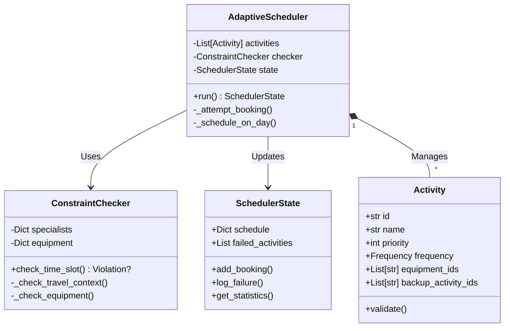

# 📐 Low-Level System Design

This document details the software specifications for the **Adaptive Health Allocator**. It covers the class structures, method signatures, and the exact Pydantic schemas used to enforce data integrity.

---

## 1. Class Diagrams

The system follows a strict Object-Oriented Design (OOD) where the `AdaptiveScheduler` acts as the orchestrator for `Activity` objects, validated by the `ConstraintChecker`.

### Core Class Hierarchy



---

## 2. Pydantic Models (The Schema)

We use **Pydantic V2** for strict data validation. These models are the "contract" between the Generative AI layer and the Scheduling Engine.

### A. The `Activity` Model

Represents a single task unit.

```python
class Activity(BaseModel):
    id: str = Field(..., description="Unique ID (e.g., act_001_p)")
    name: str
    type: str  # Enum: Fitness, Food, Medication, Therapy, Other
    priority: int = Field(..., ge=1, le=5, description="1=Critical, 5=Optional")
    
    duration_minutes: int = Field(..., ge=10)
    preparation_duration_minutes: int = 0
    
    frequency: Frequency  # Nested Model
    
    # Resource Dependencies
    specialist_id: Optional[str] = None
    equipment_ids: List[str] = []
    
    # Resilience Links
    backup_activity_ids: List[str] = []
    
    # Location Logic
    location: str = "Home"  # Default
    remote_capable: bool = False

```

### B. The `Frequency` Model

Defines how often a task should occur.

```python
class Frequency(BaseModel):
    pattern: Literal["Daily", "Weekly", "Monthly"]
    count: int = 1  # e.g., 3 times per week
    preferred_days: Optional[List[int]] = None  # 0=Mon, 6=Sun

```

### C. The `TimeSlot` Model

Represents a finalized booking in the schedule.

```python
class TimeSlot(BaseModel):
    activity_id: str
    date: date
    start_time: time
    duration_minutes: int
    is_backup: bool = False  # Critical for UI visualization
    original_activity_id: Optional[str] = None  # Traceability

```

---

## 3. Method Signatures (The Logic)

### `scheduler/engine.py`

#### `run(self) -> SchedulerState`
**Description:**  
The main loop. Iterates through every day of the simulation, attempting to fill weekly quotas for all activities.

**Returns:**  
A fully populated `SchedulerState` object containing the schedule and failure logs.

#### `_schedule_on_day(self, activity: Activity, current_date: date, is_backup: bool = False) -> bool`
**Description:**  
Attempts to place a specific activity into a specific date.

**Logic:**
1. **Quota Check:** Checks Daily Load Quotas (to prevent burnout).
2. **Candidate Generation:** Generates candidate time slots (Morning, Afternoon, Evening).
3. **Validation:** Calls `ConstraintChecker` for each slot.
4. **Commit:** If a valid slot is found, commits to `SchedulerState` and returns `True`.

**Key Parameters:**
* `is_backup` (Boolean): When `True`, it signals the Constraint Checker to bypass strict location rules ("Diplomatic Immunity").

---

### `scheduler/constraints.py`

#### `check_time_slot(self, activity, date, time, booked_slots, is_backup) -> Optional[ConstraintViolation]`

**Description:** Validates if an activity can physically happen.

* **Returns:** `None` if valid, or a `ConstraintViolation` object with a reason string.
* **Logic:**
* **Travel Check:** If `is_backup=True`, **IGNORE** location mismatch. Else, fail if user is at `Hotel` and activity is `Home`.
* **Overlap Check:** scan `booked_slots` to ensure no time conflicts.
* **Resource Check:** Ensure equipment is available (or portable).


---

## 4. Helper Structures

### `SchedulerState` (State Management)

Tracks the cumulative progress of the schedule.

* **`weekly_counter`**: `Dict[str, int]` - Tracks how many times an activity has occurred this week. Used to determine if a task is "done" for the week.
* **`daily_load`**: `Dict[date, Dict[int, int]]` - Tracks the number of P1, P2... P5 tasks scheduled on a given day. Used to cap intensity.

### `ConstraintViolation` (Error Handling)

A structured error object used for forensic logging.

```python
@dataclass
class ConstraintViolation:
    constraint_type: str  # "Travel", "Overlap", "Capacity"
    reason: str           # Human-readable message
    activity_id: str
    date: date

```