# 📐 Low-Level System Design

This document details the software specifications for the **Adaptive Health Allocator**. It covers the class structures, method signatures, and the exact logic flows used to enforce data integrity and schedule generation.

---

## 1. Class Diagrams & Data Models

The system follows a strict Object-Oriented Design (OOD) where the `AdaptiveScheduler` acts as the orchestrator for `Activity` objects, validated by the `ConstraintChecker`.

### Core Class Hierarchy


### 2. Pydantic Models (The Schema)

We use **Pydantic V2** for strict data validation. These models are the "contract" between the Generative AI layer and the Scheduling Engine.

#### A. The `Activity` Model

Represents a single task unit.

```python
class Activity(BaseModel):
    id: str = Field(..., description="Unique ID (e.g., act_001_p)")
    name: str
    type: str  # Enum: Fitness, Food, Medication, Therapy, Other
    priority: int = Field(..., ge=1, le=5, description="1=Critical, 5=Optional")
    
    duration_minutes: int = Field(..., ge=10)
    preparation_duration_minutes: int = 0
    
    frequency: Frequency  # Nested Model
    
    # Resource Dependencies
    specialist_id: Optional[str] = None
    equipment_ids: List[str] = []
    
    # Resilience Links
    backup_activity_ids: List[str] = []
    
    # Location Logic
    location: str = "Home"  # Default
    remote_capable: bool = False

```

#### B. The `Frequency` Model

Defines how often a task should occur.

```python
class Frequency(BaseModel):
    pattern: Literal["Daily", "Weekly", "Monthly"]
    count: int = 1  # e.g., 3 times per week
    preferred_days: Optional[List[int]] = None  # 0=Mon, 6=Sun

```

#### C. The `TimeSlot` Model

Represents a finalized booking in the schedule.

```python
class TimeSlot(BaseModel):
    activity_id: str
    date: date
    start_time: time
    duration_minutes: int
    is_backup: bool = False  # Critical for UI visualization
    original_activity_id: Optional[str] = None  # Traceability

```


---

## 3. The Adaptive Orchestrator (The "Engine")

**Role:** The "Conductor" of the orchestra.

Located in `scheduler/engine.py`, the `AdaptiveScheduler` implements a **Heuristic-Based Greedy Solver**. It does not check every infinite possibility; instead, it sorts tasks by difficulty and places them using a "Best Fit" strategy.

### High-Level Architecture

The Engine coordinates three components:

1. **The Police (`ConstraintChecker`):** Enforces hard rules (Physics/Reality).
2. **The Judge (`SlotScorer`):** Enforces soft rules (Preferences/Burnout).
3. **The Memory (`SchedulerState`):** Tracks bookings and failures.

### The Execution Pipeline (`run`)

The scheduling process follows a strict "Fail Fast, Fail Safe" pipeline:


### The Decision Core (`_attempt_placement`)

This logic determines the fate of a single task instance.

```mermaid
flowchart TD
    Start([Attempt Placement]) --> Gen[Generate Candidates]
    Gen --> CandidateLoop{Loop Candidates}
    
    CandidateLoop -- No Candidates Left --> CheckValid{Any Valid Slots?}
    CandidateLoop -- Next (Date, Time) --> Quota{Quota Check?}
    
    Quota -- Full (Burnout) --> CandidateLoop
    Quota -- OK --> Hard{"Hard Constraints<br>(Checker)"}
    
    Hard -- Violation --> CandidateLoop
    Hard -- Valid --> Soft["Soft Scoring<br>(Scorer)"]
    
    Soft --> Save[Add to Valid List] --> CandidateLoop
    
    CheckValid -- No --> ReturnFalse([Return False])
    CheckValid -- Yes --> SortValid[Sort by Score]
    SortValid --> PickBest[Pick Top Candidate]
    PickBest --> Commit[State.add_booking] --> ReturnTrue([Return True])

```



