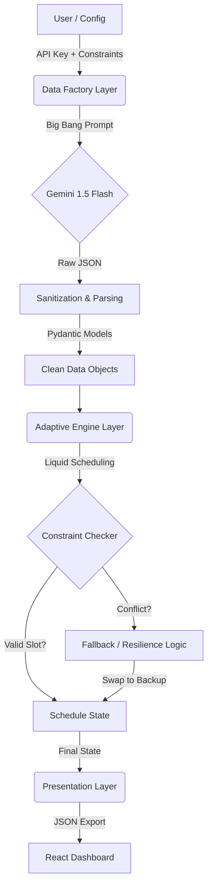

# 🏛️ System Architecture

The **Adaptive Health Allocator** is built on a modular **3-Stage Pipeline**: Generation, Scheduling, and Presentation. This architecture decouples the "World Creation" (GenAI) from the "World Solving" (Algorithms), ensuring that the scheduler is deterministic and testable even though the input data is dynamic.

---

## 🏗️ High-Level Diagram

The system follows a linear data flow, transforming vague requirements into a concrete, resilient schedule.

---

## 1. The Data Factory Layer (Generators)

**Role:** The "Creator" that builds the simulation world.

The core challenge with LLMs is hallucination and malformed data. Our architecture mitigates this using a **"Belt and Suspenders"** strategy.

### Key Components

* **`generators/data_factory.py`**: The main entry point.
* **"Big Bang" Strategy:** Instead of making 50 small API calls (which hits rate limits), we issue **one massive prompt** requesting all 50 activity pairs at once. This reduces latency by ~80%.
* **Sanitization Loop:** A custom logic layer that sits *between* the LLM response and Pydantic validation. It auto-corrects common errors:
* *Frequency Fix:* Converts hallucinated "Custom" patterns to "Weekly".
* *Duration Fix:* Bumps impossible "2-minute" workouts to a minimum of 10 minutes.
* *Type Casting:* Ensures IDs are strings and Dates are ISO-8601 formatted.

---

## 2. The Adaptive Engine Layer (Scheduler)

**Role:** The "Brain" that solves the time-allocation problem.

This is not a simple calendar filler; it is a **constraint satisfaction engine** with a bias towards completion (resilience).

### Core Logic: Liquid Scheduling

Traditional schedulers are rigid ("Gym is on Monday"). Our engine uses **Liquid Weekly Quotas**:

1. **The Bucket:** Each activity has a quota (e.g., "3 times/week").
2. **The Flow:** The scheduler iterates through days. If Monday is full (or blocked by travel), the task "flows" naturally to Tuesday.
3. **Completion:** The engine is satisfied as soon as the *Quota* is met, regardless of the specific day.

### The Fallback Chain (Resilience Module)

When a high-priority task is blocked, the engine triggers a **Resilience Loop**:

1. **Primary Attempt:** Try to schedule "Heavy Lifting (Gym)".
2. **Failure Detection:** Blocked by "Travel (Remote Cabin)".
3. **Immediate Swap:** The engine retrieves the linked **Backup Activity** ("Bodyweight Flow").
4. **Diplomatic Immunity:** The backup is scheduled *immediately* on the same day, counting towards the Primary's weekly quota.

---

## 3. Constraint Validation (Guardrails)

**Role:** The "Law" that enforces physical reality.

Located in `scheduler/constraints.py`, this module answers a binary question: *"Can Activity X happen at Time Y?"*

### The "Diplomatic Immunity" Pattern

A critical architectural decision was how to handle **Travel Constraints**.

* **Standard Rule:** If User is at a `Hotel` or `Remote Cabin`, block all `Location: Home` activities.
* **The Problem:** This blocked Backup activities (like "Home Yoga") which are technically portable.
* **The Solution:** The Constraint Checker grants **Diplomatic Immunity** to any activity flagged as `is_backup=True`. It bypasses the location check, assuming backups are low-friction and portable by design.

---

## 4. State Management (Memory)

**Role:** The "Ledger" that tracks truth.

* **`ScheduleState` Class:** Maintains the immutable record of:
* **Booked Slots:** The final timeline.
* **Daily Load:** Heatmaps of intensity per day (used to prevent burnout).
* **Failure Logs:** Detailed forensic reports on *why* a specific task failed (e.g., "Blocked by Travel" vs "Capacity Full").

---

## 5. Data Models (Schema)

The system relies on strict typing via **Pydantic Models** (`models.py`) to ensure data integrity across the pipeline.

| Model | Purpose | Key Fields |
| --- | --- | --- |
| **Activity** | Represents a task | `id`, `priority`, `duration`, `frequency`, `backup_activity_ids` |
| **Specialist** | A human resource | `id`, `availability` (shifts), `days_off` |
| **TravelPeriod** | A context modifier | `start_date`, `end_date`, `location`, `remote_activities_only` |
| **Equipment** | A physical resource | `is_portable` (Boolean flag for travel logic) |